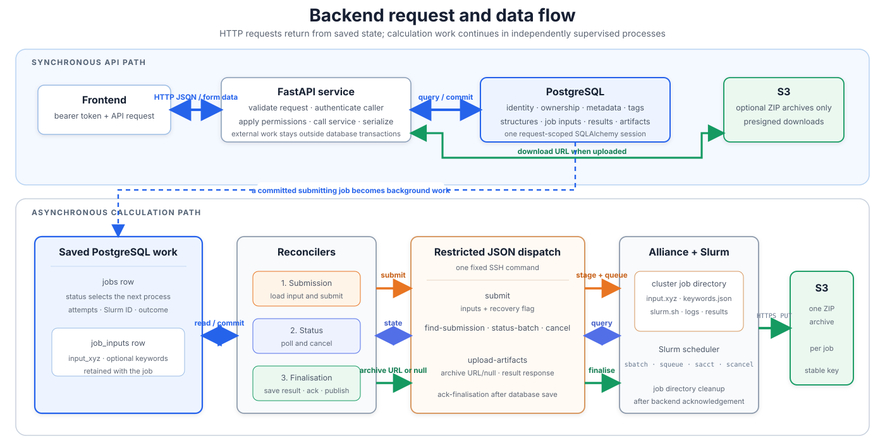

# Backend Data Flow

This document shows how information moves through the Molmaker backend. For
endpoint schemas, use Swagger. For access rules, see
[Ownership and Permissions](ownership-and-permissions.md).

## Main Components

| Component | Responsibility |
|---|---|
| FastAPI routers | Validate HTTP requests, declare response models, and call shared services. |
| Auth0 | Issues access tokens and provides the signing keys used to verify them. |
| Permission and service modules | Apply ownership rules, perform business operations, and serialize responses. |
| PostgreSQL | Stores users, groups, jobs, structures, tags, orchestration state, retained calculation inputs, results, and frontend artifacts. |
| Reconciler processes | Submit jobs, poll Slurm, request cancellation, and finalise artifacts. |
| Alliance dispatch | Accepts one validated JSON request per cluster operation and provides the restricted boundary to Slurm. |
| Alliance job directory | Holds the input, script, logs, and results while a calculation is being processed. |
| AWS S3 or Garage | Optionally stores ZIP archives uploaded during job finalisation. The backend exposes only archives explicitly recorded as uploaded. |

## Overall Flow



*Figure 1. Synchronous API requests and asynchronous calculations share
PostgreSQL state. Calculation inputs travel directly from PostgreSQL to the
restricted cluster interface; no backend file-staging step is involved.*

The normal API path returns quickly. Calculation work continues later because
the API commits a job in `submitting` and the reconcilers select jobs by saved
status. PostgreSQL is therefore the hand-off between separate operating-system
processes, not an active coordinator.

PostgreSQL is authoritative for identity, ownership, metadata, structures, job
state, exact calculation inputs, results, frontend artifacts, and archive
availability. When enabled, the selected object-storage service stores only job ZIP archives. Alliance job
directories are temporary working storage created from a submission request
and removed after the backend saves the returned result and acknowledges
cleanup.

## Authentication and Authorization

1. The client sends an Auth0 bearer token.
2. `auth.py` obtains Auth0's JSON Web Key Set and verifies the token signature,
   issuer, audience, and configured algorithm.
3. The verified token's `sub` identifies the caller.
4. The route loads that person's local `users` row. Auth0 proves identity; the
   database supplies role and group membership.
5. Shared permission functions decide whether the caller may read or change the
   requested resource.

Asset decisions use the job or structure's saved `user_sub` and `group_id`, not
the owner's current group membership. This preserves deliberate co-ownership
when a user later leaves a group.

## Ordinary API Request

For a typical read or edit:

1. FastAPI validates path, query, form, and JSON values.
2. A dependency opens one SQLAlchemy session for the request.
3. The route verifies the token and loads the local caller.
4. A service loads the target and applies the shared permission predicate.
5. The service reads or changes PostgreSQL rows.
6. Writes commit through `commit_or_rollback`; failed saves roll back.
7. A serializer returns only fields allowed by the response schema.
8. The request dependency closes the session.

Job responses intentionally omit orchestration-only fields. Calculation
creation and ordinary job APIs use the same `JobResponse`; administrator lists
add owner email and group name for context.

## Calculation Creation

All calculation endpoints call `create_calculation_job`:

1. Validate and normalize calculation metadata.
2. Require exactly one molecule source: an uploaded XYZ file or an accessible
   stored structure.
3. Read and validate the bounded XYZ text. For a stored structure, read its
   PostgreSQL content and keep that exact text as the calculation snapshot.
4. Parse the optional keywords file as a JSON object.
5. Create the `jobs` row with `status=submitting`, the requested archive
   preference, archive status `pending`, ownership, tags, and at most one
   linked source structure. The optional multipart field `upload_archive`
   defaults to `true`.
6. Create the one-to-one `job_inputs` row with `input_xyz`, optional `keywords`,
   and the effective Slurm time and memory request. Admins and group admins may
   override either resource within the backend-configured range; omitted values
   use the configured defaults.
7. Commit the job, inputs, tags, and relationship together, then return
   `201 Created`.

`POST /calculation/workflow/bond_angle_scan` accepts the scan specification as
a JSON multipart field. The backend validates its coordinate, 1-based atom
indices, relaxation flag, value range, and XYZ atom rows. It enforces the
backend-configured `MAX_SCAN_POINTS` limit and normalizes every range form to
one explicit `values` list before storing it in `job_inputs.keywords`. The
dedicated workflow fixes the level of theory at CCSD(T)/6-311+G(2d,p). A custom
calculation may also use `calculation_type=scan`; in that case the scan
specification comes from its required keywords JSON file and the caller-selected
method and basis set are retained.

If the save fails, the transaction rolls back all of those rows. Cluster
submission and result-upload URL generation never run in the HTTP request.

Calculation creation currently links at most one source Structure, while the
database relationship intentionally permits a list for future calculations
that may use multiple structures. `job_inputs.input_xyz` remains the immutable
prepared input used for the submitted calculation.

## Asynchronous Calculation Flow

After creation, three processes use the job row as a durable queue:

1. The submission reconciler loads `job_inputs` and sends one JSON request with
   the inputs and calculation settings.
2. Cluster dispatch safely creates the Alliance job directory, writes
   `input.xyz`, optional `keywords.json`, and `slurm.sh`, then submits to Slurm.
3. The status reconciler requests allocation states in batches and stores the
   public status and runtime.
4. Terminal Slurm outcomes enter the internal `finalising` state.
5. The finalisation reconciler reads the storage service saved when the job was
   created and sends one fresh presigned PUT URL only when the global archive
   switch is enabled and the job requested an archive. Otherwise it sends JSON
   null.
6. The cluster optionally uploads the ZIP and always returns parsed results and
   frontend artifacts through SSH stdout. The backend saves that content and
   the archive outcome in PostgreSQL, makes the external terminal result
   available, and then acknowledges cluster cleanup.
   Scan jobs require the multi-frame `scan.xyz` artifact.
7. Job endpoints return state, results, and artifacts from PostgreSQL. The
   archive endpoint authorizes the caller and creates a presigned download URL
   from that same saved service.

See [Job Orchestration](job-orchestration.md) for retries, cancellation, and
recovery.

## Structure and Artifact Storage

PostgreSQL stores structure metadata, XYZ content, and thumbnails. Structure
list responses contain metadata only; a structure detail response contains the
stored content and thumbnail. Structure text is limited to 4 MiB. Thumbnails
are limited to 8 MiB and must have both the `image/png` media type and PNG file
signature before the backend stores them.

When enabled, AWS S3 or Garage stores only one deterministic ZIP per job:

```text
AWS S3: {S3_BUCKET_ROOT}/archive/{job_id}.zip
Garage: {GARAGE_ARCHIVE_PREFIX}/{job_id}.zip
```

`ARCHIVE_STORAGE_SERVICE` is copied onto each new job and is not changed later,
so changing the deployment default cannot redirect an existing job. AWS
credentials use boto3's standard credential provider chain; Garage has a
separate explicit credential and endpoint profile. With
`ARCHIVE_UPLOAD_ENABLED=false` or `upload_archive=false`, finalisation does not
instantiate a storage client, create a URL, ZIP files, or perform an HTTP
upload.

The current Orcinus Garage proxy strips a routing prefix before Garage verifies
the S3 signature. The Garage adapter therefore signs the short path Garage will
receive and inserts `GARAGE_PROXY_PATH_PREFIX` afterward. The signing origin,
encoded object path, and signing query are otherwise preserved. Set the prefix
empty when the proxy is changed to forward the signed path unchanged.

Presigned URLs are short-lived capabilities:

- finalisation creates a new archive PUT URL for each transfer attempt and
  sends it only through the JSON request body;
- the archive endpoint creates a new GET URL for each download request; and
- presigned URLs are never written to disk, stored in PostgreSQL, or logged.

An archive can reach object storage before its matching database result is verified. If
finalisation exhausts its attempts before saving that result, the backend does
not expose the possibly uploaded ZIP. The archive becomes downloadable only
after the matching result is validated and saved with
`archive_uploaded=true`. Archive-disabled jobs still expose their saved result
and frontend artifacts; their job response reports `archive_upload_status` as
`disabled`, and the archive endpoint reports it unavailable.

## Ownership, Tags, and Lists

Jobs and structures can be user-owned, group-owned, or co-owned. Personal lists
query `user_sub`; group lists query the caller's current `group_id`.
Soft-deleted resources are absent from public lists and lookups.

Tags are case-insensitive and stored in lowercase. Tag rows are unique per
user, so two users can each own a `water` row. Assets expose unique attached tag
names to every authorized reader, regardless of who owns the underlying rows.
Additive updates reuse or create the caller's tag rows without duplicating a
visible name; replacement removes all asset-tag links before attaching the
supplied names in the caller's namespace.

The complete permission matrix is in
[Ownership and Permissions](ownership-and-permissions.md).

## Process and Configuration Boundary

The API, submission reconciler, status reconciler, and finalisation reconciler
are four separate processes. Each loads the file selected by
`BACKEND_ENV_FILE` (or the repository `.env` fallback) and caches its own
validated `BackendSettings`, so environment changes require a restart.

There is no in-memory queue or shared configuration process. PostgreSQL retains
the information needed for the next process or restarted worker to continue.

## Code Map

| Path | Main responsibility |
|---|---|
| `main.py` | Builds FastAPI and attaches routers. |
| `auth.py` | Verifies Auth0 access tokens. |
| `permissions.py` | Contains reusable permission predicates. |
| `asset_service.py` | Lists, serializes, tags, transfers, and soft-deletes assets. |
| `calculation/job_creation_service.py` | Validates calculation inputs and saves jobs with `job_inputs`. |
| `jobs/routes.py` | Reads, edits, cancels, and soft-deletes jobs. |
| `s3/routes.py` and `storage.py` | Authorize and create artifact URLs. |
| `database.py` and `models.py` | Configure SQLAlchemy and define persistent data. |
| `settings.py` | Loads and validates backend environment settings. |
| `orchestration/` | Contains the JSON cluster client and three reconcilers. |
| `deploy/systemd/` | Runs one supervised process for each reconciler. |

## Adding a Backend Operation

When adding an endpoint:

1. define the request and response without exposing internal identifiers;
2. verify identity and load the local user;
3. use the shared permission functions and saved resource ownership;
4. keep external work outside database transactions;
5. use `commit_or_rollback` for request-path database writes;
6. update the endpoint docstring; and
7. add tests for permissions, response shape, rollback, and external failures.

Long-running or restart-sensitive work should be represented by durable
database state and handled by a supervised process instead of an in-process
FastAPI background task.
