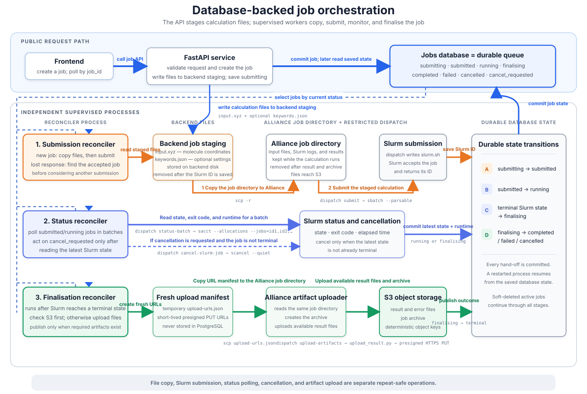
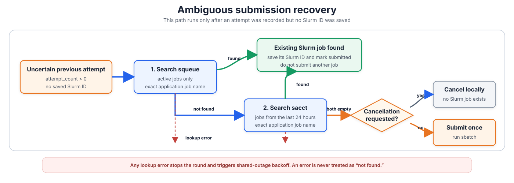
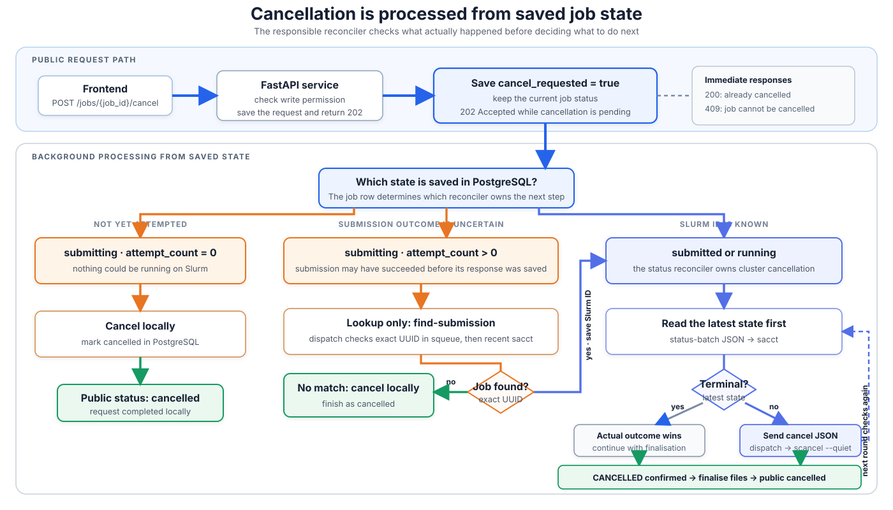

# Job Orchestration

This document explains the calculation-job lifecycle. For endpoint schemas,
use Swagger. For the surrounding backend components, see
[Backend Data Flow](backend-data-flow.md).

## Overview

- Calculation creation stores the `jobs` row, exact `input.xyz` text, and
  optional keywords in one PostgreSQL transaction. It returns `201 Created`
  without waiting for the cluster.
- Clients use only the application `job_id`. Slurm identifiers, retries,
  `terminal_status`, and upload details remain internal.
- PostgreSQL hands work between the API and three independently supervised
  reconciler processes.
- Every cluster operation is one versioned JSON request to the restricted
  `dispatch.py` command over SSH stdin. The backend does not stage calculation
  files or URL manifests on its own disk.

*Figure 1. PostgreSQL retains the job state and calculation inputs. The cluster
stages its own job directory from the submission request, Slurm runs the
calculation, and finalisation sends an archive URL or JSON null directly.*

## Job States

| Internal status | Public status | Meaning |
|---|---|---|
| `submitting` | `submitting` | The job and its database-backed inputs exist, but no accepted Slurm job is saved. |
| `submitted` | `submitted` | Slurm accepted the job and it is waiting to run. |
| `running` | `running` | Slurm reports an active state. |
| `finalising` | `running` | Slurm finished and results are being collected; archive upload and cleanup may still be pending. |
| `completed` | `completed` | Successful result data is ready. |
| `failed` | `failed` | The calculation, cluster, or orchestration failed. |
| `cancelled` | `cancelled` | Cancellation was confirmed and finalisation finished. |

While a job is `finalising`, `terminal_status` stores the outcome that will be
published: `completed`, `failed`, or `cancelled`. `failure_reason` identifies
the type of failure and `failure_message` contains a safe explanation when one
is available.

## The Three Reconcilers

### 1. Submission

The submission reconciler selects `submitting` jobs and loads their immutable
input from `job_inputs`. Before it calls the cluster, it commits the increased
`attempt_count`. It then sends one `submit` request containing the calculation
settings, `input_xyz`, optional keywords, backend-configured Slurm time and
memory limits, and whether recovery is required.

On the cluster, `dispatch.py`:

1. searches for an earlier accepted job when `recover_existing=true`;
2. creates `jobs/{job_id}` through a temporary directory;
3. writes `input.xyz`, optional `keywords.json`, and `slurm.sh`; and
4. runs `sbatch --parsable` and returns the Slurm ID.

For `calculation_type=scan`, the required keywords object is the validated scan
specification with a backend-generated explicit `values` list. Dispatch stages
it as `keywords.json` and invokes the cluster's bond/angle/dihedral scan runner
with the job's saved method and basis set. The cluster consumes that list
directly, so it does not independently expand `steps` or `spacing` ranges.

The backend saves that ID and changes the job to `submitted`. If `sbatch` may
have succeeded but its response was lost, the next attempt searches first and
does not create a duplicate when the existing job is found.

*Figure 2. Recovery is part of one retry submission request. `dispatch.py`
checks live jobs with `squeue`, then recent accounting with `sacct`, and calls
`sbatch` only after both successful lookups are empty.*

A lookup error is never treated as “not found.” When cancellation is pending
or the attempt limit has been reached, the backend uses the lookup-only
`find-submission` command so that recovery cannot accidentally submit a job.

### 2. Status

The status reconciler includes soft-deleted `submitted` and `running` jobs. One
`status-batch` request checks each configured batch with an allocation-only
`sacct` query:

- queued Slurm states remain `submitted`;
- active states become `running`; and
- completed, cancelled, and recognized failure states become `finalising` with
  the appropriate `terminal_status`.

For Slurm's generic `FAILED` state, the cluster response also reports whether
the calculation produced `result.err`. The backend records
`calculation_failed` only when that file exists; otherwise it records the more
general `cluster_failed` reason. Exit code alone cannot make this distinction.

Missing, malformed, or unknown job results consume one job attempt. At
`MAX_ATTEMPTS`, the backend requests cancellation, records
`status_check_failed`, and logs an orphan-job alert if cancellation cannot be
confirmed.

If `cancel_requested` is set, the reconciler reads the latest state first. It
sends the repeat-safe `cancel` request only when the job is not already
terminal.

### 3. Finalisation

`ARCHIVE_UPLOAD_ENABLED` is the deployment-wide master switch. Each submission
also accepts optional multipart field `upload_archive`, which defaults to
`true` and is saved with the job. The finalisation reconciler creates one fresh
presigned PUT URL only when both values are true. The job's immutable
`archive_storage_service` selects AWS S3 or Garage. Otherwise the reconciler
does not create a storage client or URL and sends JSON null. The cluster always returns parsed
result/error data and required frontend artifacts through SSH stdout. It
creates and uploads the ZIP only when it receives a URL.

The cluster keeps the Alliance job directory until the backend validates and
commits the complete `job_results` row and archive outcome. The backend then
marks the result data and external terminal status available, sends
`ack-finalisation`, and replaces
the internal `finalising` state with the terminal state after cleanup succeeds.
If acknowledgement fails, the next attempt retries cleanup without
transferring or saving the result again. A job-specific cleanup failure is
retried up to `MAX_ATTEMPTS`; after that, the backend publishes the already
available terminal result and logs that the cluster directory may need manual
cleanup. This prevents one undeletable directory from blocking finalisation
forever.

The complete cluster response is limited to 64 MiB. Exceeding that bound is a
job-specific failure, so it consumes this job's attempt budget instead of
being treated as a shared cluster outage.

`is_uploaded` continues to mean that structured PostgreSQL results are ready.
The job response's `upload_archive` value reports the saved request.
`archive_uploaded` independently records whether the ZIP exists, while
`archive_upload_status` is `pending`, `disabled`, `uploaded`, or `unavailable`.
The result and artifact endpoints depend only on the saved result. The archive
endpoint requires `archive_uploaded=true` before creating a presigned download
URL.
Completed scan jobs expose their parsed point data through the normal result
endpoint and their multi-frame geometry through the `scan` artifact endpoint.

The ZIP upload happens before the backend validates and saves the returned
data. If validation or persistence repeatedly fails until `MAX_ATTEMPTS`, the
job becomes `failed` with `result_upload_failed`. The backend does not expose a
possibly uploaded ZIP from that incomplete attempt because no verified result
was saved. Disabling archive upload does not change a job's completed, failed,
or cancelled calculation outcome. Result and artifact endpoints remain
available, while the archive endpoint returns `409` without contacting storage.

## Retries, Outages, and Cancellation

- A job-specific retryable failure increments that job's `attempt_count`; a
  successful stage resets it. Invalid job data can fail immediately.
- A shared PostgreSQL, SSH, Slurm, or enabled-storage failure stops the round without
  consuming attempts for every affected job. The process exponentially backs
  off up to the configured maximum and resets after recovery.
- Polling intervals are measured from the start of one round to the next, and
  rounds in one reconciler process never overlap.

`POST /jobs/{job_id}/cancel` stores `cancel_requested=true`; the HTTP request
does not wait for the cluster. It returns `202` while cancellation is pending,
`200` when already cancelled, and `409` when cancellation is no longer allowed.

*Figure 3. The responsible reconciler checks the saved submission state and
the latest Slurm state before deciding whether to cancel locally or on Slurm.*

`DELETE /jobs/{job_id}` only hides a job. All reconcilers continue processing
soft-deleted active jobs, so request cancellation first when the calculation
itself should stop.

## Configuration and Deployment

[`.env.example`](../.env.example) is the backend settings reference.
`BACKEND_ENV_FILE` may select an absolute file from the process launcher; the
repository `.env` is the fallback. Each API or reconciler process caches its
own validated settings, so restart affected processes after a change.

The backend runs exactly one submission, status, and finalisation process.
Installation, database reset, deployment, and operational commands are in the
[README](../README.md#4-start-the-api-and-reconcilers).

## Restricted Alliance Dispatch

The backend connects through `CLUSTER_SSH_HOST` and invokes the exact
`CLUSTER_DISPATCH_PATH`. Its key can invoke only that no-argument dispatcher;
the requested operation is inside validated JSON, not in the remote shell
command. That restricted command's Python runs the dispatcher and uploader.
Each generated Slurm script separately activates
`SLURM_ENV_ACTIVATION_COMMAND` and invokes plain `python`, so calculations use
the activated environment. The canonical cluster sources are the files in the
reviewed `Cluster-API-QC` repository checkout, including the dispatch runner,
protocol, calculation code, and artifact uploader.

| JSON command | Cluster action |
|---|---|
| `submit` | Optionally recover an existing submission, stage its files, then run `sbatch --parsable`. |
| `find-submission` | Search exact job names with `squeue`, then the last 24 hours of `sacct`; never submit. |
| `status-batch` | Run one allocation-only `sacct` query for a batch of Slurm IDs. |
| `cancel` | Run repeat-safe `scancel --quiet`. |
| `upload-artifacts` | Pass an archive PUT URL or null, optionally upload the ZIP, and always return database-bound result data without deleting scratch. |
| `ack-finalisation` | Delete the validated job directory after the backend has saved the result. |

The matching repository commit must be deployed before the reconcilers are
enabled. See the
[README](../README.md#deploy-the-alliance-dispatch-interface) for the release
checklist and `Cluster-API-QC/runner/README.md` for the complete JSON contract,
verification examples, and rollback procedure.
